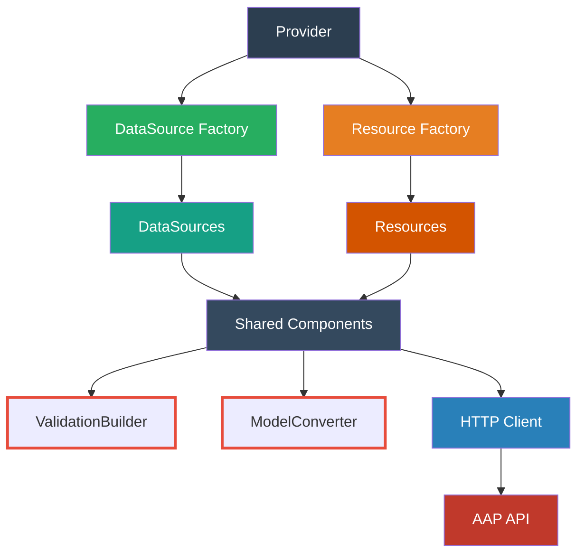
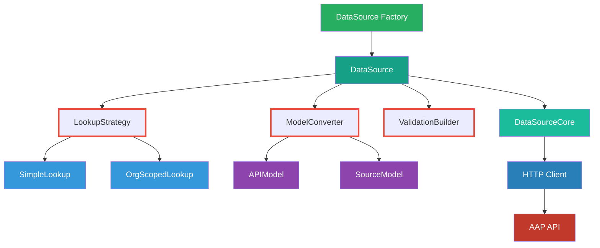
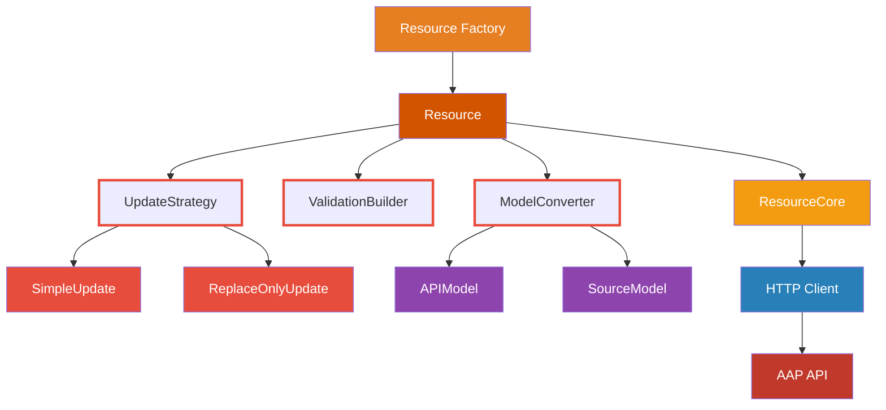

# Terraform Provider AAP Architecture

## Overview

This provider uses a composition-based architecture to minimize duplication and improve maintainability across data sources and resources.

## Core Components

### 1. Unified Model Pattern

```go
// Single model pattern instead of separate inheritance trees
type APIModel struct {
    Id          int64  `json:"id"`
    Name        string `json:"name"`
    URL         string `json:"url"`
    Description string `json:"description"`
    
    // Optional organization scope
    OrganizationScope *OrganizationScope `json:"summary_fields,omitempty"`
}

type SourceModel struct {
    Id          types.Int64  `tfsdk:"id"`
    Name        types.String `tfsdk:"name"`
    URL         types.String `tfsdk:"url"`
    Description types.String `tfsdk:"description"`
    
    // Optional organization scope
    OrganizationScope *OrganizationScope `tfsdk:"organization,omitempty"`
}
```

### 2. Composition Over Inheritance

```go
// Data sources compose behavior instead of inheriting
type DataSource struct {
    core      *DataSourceCore     // Common CRUD operations
    lookup    LookupStrategy      // How to find resources
    validator *ValidationBuilder  // How to validate input
    converter *ModelConverter     // How to convert API ↔ Terraform
}

// Pluggable strategies
type LookupStrategy interface {
    CreateURL(id int64, name, org string) string
    ValidateParams(id int64, name, org string) error
}

type SimpleLookup struct {}      // For organizations: ID OR name
type OrgScopedLookup struct {}   // For others: ID OR (name + org)
```

### 3. Centralized Validation

```go
// Declarative validation builder
type ValidationBuilder struct {
    allowsID    bool
    allowsName  bool
    requiresOrg bool
}

// Usage
func (d *OrganizationDataSource) ConfigValidators(ctx context.Context) []datasource.ConfigValidator {
    return NewValidationBuilder().
        AllowID().
        AllowName().
        Build()
}

func (d *InventoryDataSource) ConfigValidators(ctx context.Context) []datasource.ConfigValidator {
    return NewValidationBuilder().
        AllowID().
        AllowName().
        RequireOrg().
        Build()
}
```

### 4. Generic Converters

```go
// Type-safe generic conversion
type ModelConverter[API any, Source any] struct {
    apiToSource func(API) Source
    sourceToAPI func(Source) API
}

func (c *ModelConverter[API, Source]) ParseHttpResponse(body []byte) (Source, diag.Diagnostics) {
    var apiModel API
    if err := json.Unmarshal(body, &apiModel); err != nil {
        return sourceModel, diag.Diagnostics{/* error */}
    }
    return c.apiToSource(apiModel), diag.Diagnostics{}
}

// Usage
var orgConverter = ModelConverter[OrganizationAPIModel, OrganizationDataSourceModel]{
    apiToSource: func(api OrganizationAPIModel) OrganizationDataSourceModel {
        return OrganizationDataSourceModel{...}
    },
}
```

## Data Source Factory

```go
// Clean factory pattern
func NewOrganizationDataSource() datasource.DataSource {
    return &DataSource{
        core:      NewDataSourceCore(client),
        lookup:    &SimpleLookup{},
        validator: NewValidationBuilder().AllowID().AllowName(),
        converter: &orgConverter,
    }
}

func NewInventoryDataSource() datasource.DataSource {
    return &DataSource{
        core:      NewDataSourceCore(client),
        lookup:    &OrgScopedLookup{},
        validator: NewValidationBuilder().AllowID().AllowName().RequireOrg(),
        converter: &inventoryConverter,
    }
}
```

## Resource Hierarchy

Resources follow the same composition pattern but handle CRUD operations:

```go
// Resource composition
type Resource struct {
    core      *ResourceCore       // Common CRUD operations
    validator *ValidationBuilder  // Input validation
    converter *ModelConverter     // API ↔ Terraform conversion
    updater   UpdateStrategy      // How to handle updates
}

// Resource-specific strategies
type UpdateStrategy interface {
    RequiresReplacement(old, new SourceModel) bool
    PlanUpdate(old, new SourceModel) UpdatePlan
}

type SimpleUpdate struct {}      // For resources with straightforward updates
type ReplaceOnlyUpdate struct {} // For resources that require replacement
```

### Resource Factories

```go
// Resource factory pattern
func NewInventoryResource() resource.Resource {
    return &Resource{
        core:      NewResourceCore(client),
        validator: NewValidationBuilder().RequireField("name").RequireField("organization"),
        converter: &inventoryConverter,
        updater:   &SimpleUpdate{},
    }
}

func NewJobResource() resource.Resource {
    return &Resource{
        core:      NewResourceCore(client),
        validator: NewValidationBuilder().RequireField("job_template_id"),
        converter: &jobConverter,
        updater:   &ReplaceOnlyUpdate{}, // Jobs can't be updated, only replaced
    }
}
```

### Resource Core Operations

```go
type ResourceCore struct {
    client    HTTPClient
    apiPath   string
}

func (r *ResourceCore) Create(ctx context.Context, data SourceModel) (SourceModel, diag.Diagnostics) {
    // Common create logic
}

func (r *ResourceCore) Read(ctx context.Context, id string) (SourceModel, diag.Diagnostics) {
    // Common read logic
}

func (r *ResourceCore) Update(ctx context.Context, id string, data SourceModel) (SourceModel, diag.Diagnostics) {
    // Common update logic
}

func (r *ResourceCore) Delete(ctx context.Context, id string) diag.Diagnostics {
    // Common delete logic
}
```

## Benefits

- **Reduced duplication**: Single implementation of common patterns
- **Improved testability**: Mock individual components, not entire base classes
- **Better maintainability**: Changes in one place affect all consumers
- **Type safety**: Generics ensure correct type matching
- **Consistency**: All resources follow the same patterns
- **Flexibility**: Easy to add new lookup strategies or validation rules

## Architecture Diagrams

### Overview - Top Level Structure



### DataSource Factory Detail



### Resource Factory Detail



## Migration Strategy

1. **Extract common patterns** into shared components
2. **Replace inheritance** with composition gradually
3. **Centralize validation** using builder pattern
4. **Implement generic converters** for type safety
5. **Update factories** to use new components

This approach reduces code complexity while maintaining all existing functionality. 